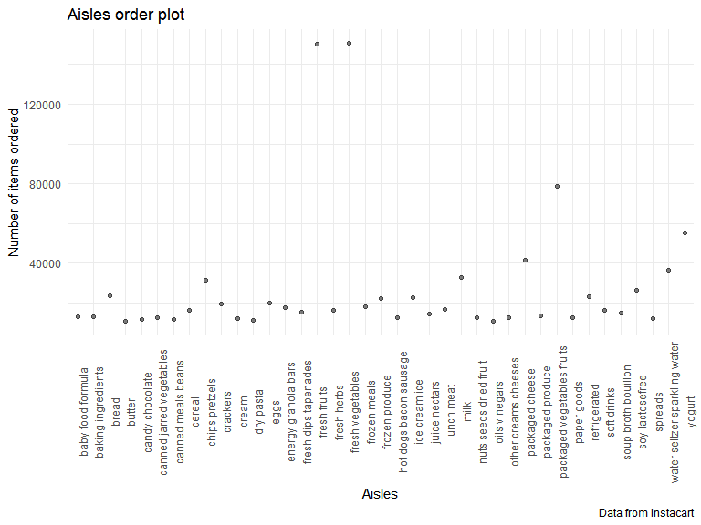
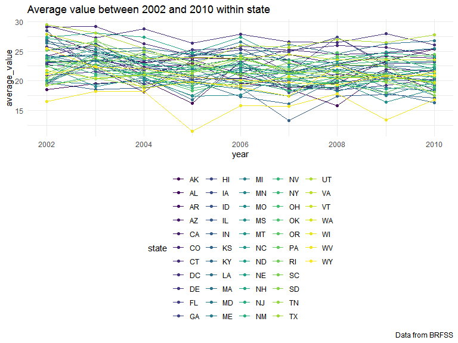

P8105 Homework 3
================
Junhui Mi
2019/10/8

# Problem 1

``` r
library(p8105.datasets)
data("instacart")
instacart %>%
  group_by(aisle) %>%
  summarize(n = n()) %>%
  arrange(desc(n)) %>%
  head(1) %>%
  knitr::kable()
```

| aisle            |      n |
| :--------------- | -----: |
| fresh vegetables | 150609 |

``` r
instacart %>%
  distinct(aisle) %>%
  nrow()
```

    ## [1] 134

``` r
instacart %>%
  group_by(aisle) %>%
  summarize(n = n()) %>%
  filter(n > 10000) %>%
  ggplot(aes(x = reorder(aisle, n), y = n)) + 
  geom_col(fill = "blue") + 
  labs(
    title = "Plot of Aisles Order Number",
    x = "Aisles",
    y = "Number of items ordered",
    caption = "Data from instacart") +
  coord_flip()
```



``` r
instacart %>%
  filter(aisle %in% c("baking ingredients", "dog food care", 
                      "packaged vegetables fruits")) %>%
  group_by(aisle, product_name) %>%
  summarize(number_of_selling = n()) %>%
  arrange(desc(number_of_selling)) %>%
  top_n(3) %>%
  knitr::kable(caption = "Three most popular products",
               col.names = c("Product category", "Product name",
                             "Number of selling"))
```

    ## Selecting by number_of_selling

| Product category           | Product name                                  | Number of selling |
| :------------------------- | :-------------------------------------------- | ----------------: |
| packaged vegetables fruits | Organic Baby Spinach                          |              9784 |
| packaged vegetables fruits | Organic Raspberries                           |              5546 |
| packaged vegetables fruits | Organic Blueberries                           |              4966 |
| baking ingredients         | Light Brown Sugar                             |               499 |
| baking ingredients         | Pure Baking Soda                              |               387 |
| baking ingredients         | Cane Sugar                                    |               336 |
| dog food care              | Snack Sticks Chicken & Rice Recipe Dog Treats |                30 |
| dog food care              | Organix Chicken & Brown Rice Recipe           |                28 |
| dog food care              | Small Dog Biscuits                            |                26 |

Three most popular products

``` r
instacart %>%
  filter(product_name %in% c("Pink Lady Apples", "Coffee Ice Cream")) %>%
  group_by(product_name, order_dow) %>%
  summarize(meantime_of_selling = mean(order_hour_of_day)) %>%
  pivot_wider(
    names_from = order_dow,
    values_from = meantime_of_selling
  ) %>%
  knitr::kable(caption = "Mean Order time of two product", 
               col.names = c("Product Name", "Sunday", "Monday", "Tuesday",
                             "Wednesday", "Thursday", "Friday", "Saturday"),
               digits = 0)
```

| Product Name     | Sunday | Monday | Tuesday | Wednesday | Thursday | Friday | Saturday |
| :--------------- | -----: | -----: | ------: | --------: | -------: | -----: | -------: |
| Coffee Ice Cream |     14 |     14 |      15 |        15 |       15 |     12 |       14 |
| Pink Lady Apples |     13 |     11 |      12 |        14 |       12 |     13 |       12 |

Mean Order time of two product

# Problem 2

``` r
library(p8105.datasets)
data("brfss_smart2010")
brfss_ordered = brfss_smart2010 %>%
  janitor::clean_names() %>%
  filter(topic == "Overall Health",
         response %in% c("Excellent","Very good", "Good","Fair","Poor")) %>%
  mutate(response = forcats::fct_relevel(response, 
                                        c("Poor", "Fair", "Good", 
                                          "Very good","Excellent")))

brfss_ordered %>%
 filter(year == 2002) %>%
  group_by(locationabbr, locationdesc) %>%
  summarize(n = n()) %>%
  group_by(locationabbr) %>%
  summarize(observed_locations_2002 = n()) %>%
  filter(observed_locations_2002 >= 7) %>%
  knitr::kable()
```

| locationabbr | observed\_locations\_2002 |
| :----------- | ------------------------: |
| CT           |                         7 |
| FL           |                         7 |
| MA           |                         8 |
| NC           |                         7 |
| NJ           |                         8 |
| PA           |                        10 |

``` r
brfss_ordered %>%
 filter(year == 2010) %>%
  group_by(locationabbr, locationdesc) %>%
  summarize(n = n()) %>%
  group_by(locationabbr) %>%
  summarize(observed_locations_2010 = n()) %>%
  filter(observed_locations_2010 >= 7) %>%
  knitr::kable()
```

| locationabbr | observed\_locations\_2010 |
| :----------- | ------------------------: |
| CA           |                        12 |
| CO           |                         7 |
| FL           |                        41 |
| MA           |                         9 |
| MD           |                        12 |
| NC           |                        12 |
| NE           |                        10 |
| NJ           |                        19 |
| NY           |                         9 |
| OH           |                         8 |
| PA           |                         7 |
| SC           |                         7 |
| TX           |                        16 |
| WA           |                        10 |

``` r
brfss_average = brfss_ordered %>%
  filter(response == "Excellent") %>%
  group_by(year, locationabbr) %>%
  summarize(average_value = mean(data_value, na.omit = TRUE))
brfss_average %>%
  mutate(state = locationabbr) %>%
  ggplot(aes(x = year, y = average_value, color = state)) + 
    geom_point() + geom_line() + theme(legend.position = "bottom") +
  labs(title = "Average value between 2002 and 2010 within state",
       caption = "Data from BRFSS")
```



``` r
brfss_ordered %>%
  filter(year %in% c(2006, 2010),
         locationabbr == "NY") %>%
  mutate(county = locationdesc) %>%
  ggplot(aes(x = response, y = data_value, fill = county)) +
  geom_bar(stat = "identity", position = "dodge", width = 0.5) +
  facet_grid(~year) + 
  viridis::scale_fill_viridis(discrete = TRUE) +
  theme(legend.position = "bottom") +
  labs(title = "Distribution of responses among counties in NY State",
       caption = "Data from BRFSS")
```


