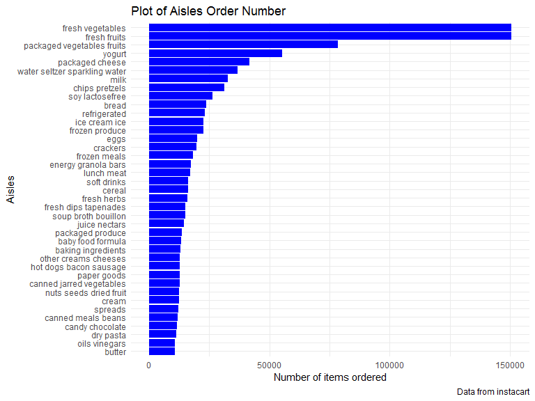
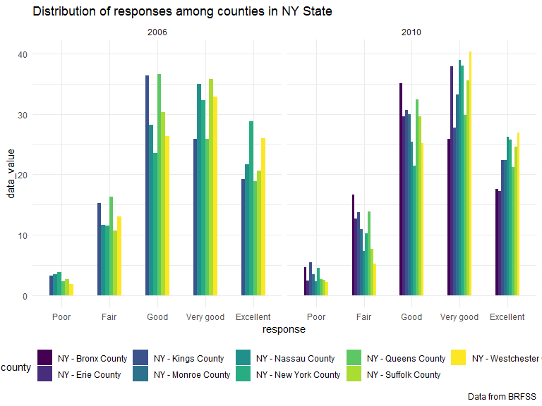
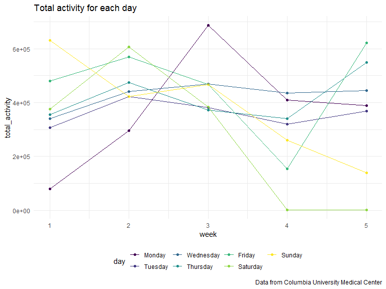
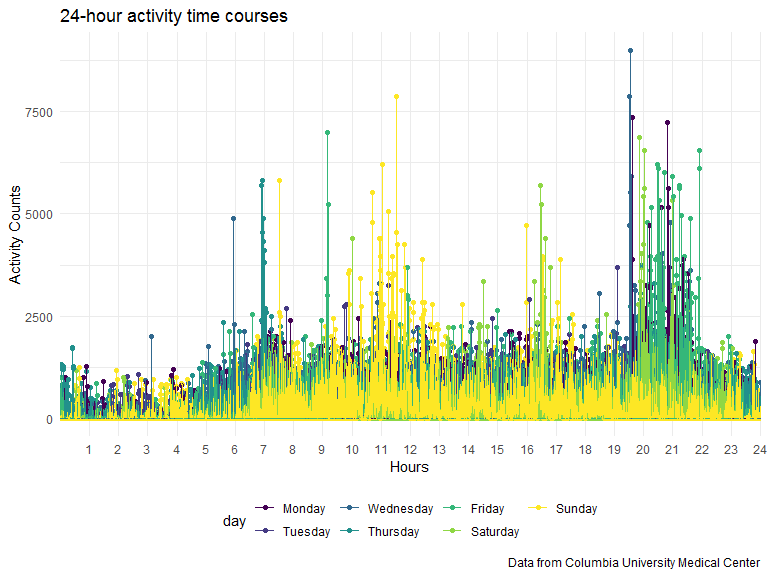

P8105 Homework 3
================
Junhui Mi
2019/10/8

# Problem 1

### 0\)

``` r
library(p8105.datasets)
data("instacart")
instacart %>%
  head(3) %>%
  knitr::kable()
```

| order\_id | product\_id | add\_to\_cart\_order | reordered | user\_id | eval\_set | order\_number | order\_dow | order\_hour\_of\_day | days\_since\_prior\_order | product\_name                                 | aisle\_id | department\_id | aisle                | department |
| --------: | ----------: | -------------------: | --------: | -------: | :-------- | ------------: | ---------: | -------------------: | ------------------------: | :-------------------------------------------- | --------: | -------------: | :------------------- | :--------- |
|         1 |       49302 |                    1 |         1 |   112108 | train     |             4 |          4 |                   10 |                         9 | Bulgarian Yogurt                              |       120 |             16 | yogurt               | dairy eggs |
|         1 |       11109 |                    2 |         1 |   112108 | train     |             4 |          4 |                   10 |                         9 | Organic 4% Milk Fat Whole Milk Cottage Cheese |       108 |             16 | other creams cheeses | dairy eggs |
|         1 |       10246 |                    3 |         0 |   112108 | train     |             4 |          4 |                   10 |                         9 | Organic Celery Hearts                         |        83 |              4 | fresh vegetables     | produce    |

Description of the dataset:

The Instacart dataset is an online grocery shopping dataset in 2017. The
dataset instacart contains 15 variables and 1384617 observations. Some
key variables are: “product\_name”, “aisle”, “order\_id”, “user\_id”,
“order\_dow”, “order\_hour\_of\_day”.

Use the first there rows as an example: We can see that customer with
user\_id 112108 bought “Bulgarian Yogurt”, “Organic 4% Milk Fat Whole
Milk Cottage Cheese” and “Organic Celery Hearts” at 10:00 in the
morning.

### 1\)

``` r
instacart %>%
  group_by(aisle) %>%
  summarize(n = n()) %>%
  arrange(desc(n)) %>%
  head(1) %>%
  knitr::kable()
```

| aisle            |      n |
| :--------------- | -----: |
| fresh vegetables | 150609 |

``` r
instacart %>%
  distinct(aisle) %>%
  nrow()
```

    ## [1] 134

There are 134 aisles, and “fresh vegetables” are the most items ordered
from.

### 2\)

``` r
instacart %>%
  group_by(aisle) %>%
  summarize(n = n()) %>%
  filter(n > 10000) %>%
  ggplot(aes(x = reorder(aisle, n), y = n)) + 
  geom_col(fill = "blue") + 
  labs(
    title = "Plot of Aisles Order Number",
    x = "Aisles",
    y = "Number of items ordered",
    caption = "Data from instacart") +
  coord_flip()
```



Above is a plot that shows the number of items ordered in each aisle,
limiting to aisles with more than 10000 items ordered. There are 39 such
aisles. Ranking the top 3 are “fresh vegetables”, “fresh fruits”,
“packaged vegetables fruits”.

### 3\)

``` r
instacart %>%
  filter(aisle %in% c("baking ingredients", "dog food care", 
                      "packaged vegetables fruits")) %>%
  group_by(aisle, product_name) %>%
  summarize(number_of_selling = n()) %>%
  arrange(desc(number_of_selling)) %>%
  top_n(3) %>%
  knitr::kable(caption = "Three most popular products",
               col.names = c("Product category", "Product name",
                             "Number of selling"))
```

    ## Selecting by number_of_selling

| Product category           | Product name                                  | Number of selling |
| :------------------------- | :-------------------------------------------- | ----------------: |
| packaged vegetables fruits | Organic Baby Spinach                          |              9784 |
| packaged vegetables fruits | Organic Raspberries                           |              5546 |
| packaged vegetables fruits | Organic Blueberries                           |              4966 |
| baking ingredients         | Light Brown Sugar                             |               499 |
| baking ingredients         | Pure Baking Soda                              |               387 |
| baking ingredients         | Cane Sugar                                    |               336 |
| dog food care              | Snack Sticks Chicken & Rice Recipe Dog Treats |                30 |
| dog food care              | Organix Chicken & Brown Rice Recipe           |                28 |
| dog food care              | Small Dog Biscuits                            |                26 |

Three most popular products

Above is a table showing the three most popular items in each of the
aisles “baking ingredients”, “dog food care”, and “packaged vegetables
fruits”.

The three most popular items in “baking ingredients” are “Light Brown
Sugar”, “Pure Baking Soda”, “Cane Sugar”. The three most popular items
in “dog food care” are “Snack Sticks Chicken & Rice Recipe Dog Treats”,
“Organix Chicken & Brown Rice Recipe”, “Small Dog Biscuits”. The three
most popular items in “packaged vegetables fruits” are “Organic Baby
Spinach”, “Organic Raspberries”, “Organic Blueberries”.

The most popular items in “packaged vegetables fruits” have large
numbers of selling compared to the most popular items in “dog food
care”.

### 4\)

``` r
instacart %>%
  filter(product_name %in% c("Pink Lady Apples", "Coffee Ice Cream")) %>%
  group_by(product_name, order_dow) %>%
  summarize(meantime_of_selling = mean(order_hour_of_day)) %>%
  pivot_wider(
    names_from = order_dow,
    values_from = meantime_of_selling
  ) %>%
  knitr::kable(caption = "Mean Order time of two product", 
               col.names =
                 c("Product Name", "Sunday", "Monday", "Tuesday",
                   "Wednesday", "Thursday", "Friday", "Saturday"),
               digits = 0)
```

| Product Name     | Sunday | Monday | Tuesday | Wednesday | Thursday | Friday | Saturday |
| :--------------- | -----: | -----: | ------: | --------: | -------: | -----: | -------: |
| Coffee Ice Cream |     14 |     14 |      15 |        15 |       15 |     12 |       14 |
| Pink Lady Apples |     13 |     11 |      12 |        14 |       12 |     13 |       12 |

Mean Order time of two product

Above is a table showing the mean hour of the day at which Pink Lady
Apples and Coffee Ice Cream are ordered on each day of the week. We can
conclude that the main order time of the two products are between 11:00
and 15:00.

# Problem 2

### 0\)

``` r
library(p8105.datasets)
data("brfss_smart2010")
brfss_ordered = brfss_smart2010 %>%
  janitor::clean_names() %>%
  filter(topic == "Overall Health",
         response %in% c("Excellent","Very good", "Good","Fair","Poor")) %>%
  mutate(response = forcats::fct_relevel(response, 
                                        c("Poor", "Fair", "Good", 
                                          "Very good","Excellent")))
```

Firstly, we do some cleaning on BRFSS data and focus on the “Overall
Health” topic.

### 1\)

``` r
brfss_ordered %>%
 filter(year == 2002) %>%
  group_by(locationabbr, locationdesc) %>%
  summarize(n = n()) %>%
  group_by(locationabbr) %>%
  summarize(observed_locations_2002 = n()) %>%
  filter(observed_locations_2002 >= 7) %>%
  knitr::kable(caption = "Table 2002")
```

| locationabbr | observed\_locations\_2002 |
| :----------- | ------------------------: |
| CT           |                         7 |
| FL           |                         7 |
| MA           |                         8 |
| NC           |                         7 |
| NJ           |                         8 |
| PA           |                        10 |

Table 2002

In 2002, there were 6 states (CT, FL, MA, NC, NJ, PA) observed at 7 or
more locations.

``` r
brfss_ordered %>%
 filter(year == 2010) %>%
  group_by(locationabbr, locationdesc) %>%
  summarize(n = n()) %>%
  group_by(locationabbr) %>%
  summarize(observed_locations_2010 = n()) %>%
  filter(observed_locations_2010 >= 7) %>%
  knitr::kable(caption = "Table 2010")
```

| locationabbr | observed\_locations\_2010 |
| :----------- | ------------------------: |
| CA           |                        12 |
| CO           |                         7 |
| FL           |                        41 |
| MA           |                         9 |
| MD           |                        12 |
| NC           |                        12 |
| NE           |                        10 |
| NJ           |                        19 |
| NY           |                         9 |
| OH           |                         8 |
| PA           |                         7 |
| SC           |                         7 |
| TX           |                        16 |
| WA           |                        10 |

Table 2010

In 2010, there were 14 states (CA, CO, FL, MA, MD, NC, NE, NJ, NY, OH,
PA, SC, TX, WA) observed at 7 or more locations. The number of states
increased and the number of observed locations in each state increased
as well compared to 2002.

### 2\)

``` r
brfss_average = brfss_ordered %>%
  filter(response == "Excellent") %>%
  group_by(year, locationabbr) %>%
  summarize(average_value = mean(data_value, na.omit = TRUE))
brfss_average %>%
  mutate(state = locationabbr) %>%
  ggplot(aes(x = year, y = average_value, color = state)) + 
    geom_point() + geom_line() + 
  labs(title = "Average value between 2002 and 2010 within state",
       caption = "Data from BRFSS")
```


The “spaghetti” plot above shows the average value between 2002 and 2010
within states. We can see that in year 2005, 2007 and 2009, most states
experienced downs.

### 3\)

``` r
brfss_ordered %>%
  filter(year %in% c(2006, 2010),
         locationabbr == "NY") %>%
  mutate(county = locationdesc) %>%
  ggplot(aes(x = response, y = data_value, fill = county)) +
  geom_bar(stat = "identity", position = "dodge", width = 0.5) +
  facet_grid(~year) + 
  viridis::scale_fill_viridis(discrete = TRUE) +
  labs(title = "Distribution of responses among counties in NY State",
       caption = "Data from BRFSS")
```



The two-panel plot above shows the distribution of data\_value for
responses among locations in NY State in 2006 and 2010. We can see that
in 2010, more counties such as Bronx and Erie were included. The value
of “very good” also had a significant increase in year 2010.

# Problem 3

### 1\)

``` r
accel_data = read_csv("../accel_data.csv") %>%
  janitor::clean_names() %>%
  mutate(
    weekday_weekend = case_when(
    day %in% c("Saturday", "Sunday") ~ "weekend",
    day %in% c("Monday", "Tuesday", "Wednesday", "Thursday", "Friday")
    ~ "weekend",
    TRUE ~ ""),
    day = factor(day, 
                 levels = c("Monday", "Tuesday", "Wednesday", "Thursday",
                            "Friday", "Saturday", "Sunday"))) %>%
  pivot_longer(
    starts_with("activity_"),
    names_to = "minute", 
    names_prefix = "activity_",
    values_to = "counts"
  ) %>%
  mutate(minute = factor(minute, levels = c(1:1440)))
```

    ## Parsed with column specification:
    ## cols(
    ##   .default = col_double(),
    ##   day = col_character()
    ## )

    ## See spec(...) for full column specifications.

Description of the dataset:

The accel\_data contains five weeks of accelerometer data collected on a
63 year-old male with BMI 25. The dataset accel\_data has 6 variables
and 50400 observations. The existing variables are : week, day\_id, day,
weekday\_weekend, minute, counts. Key variables are: “week”, “day”,
“minute” and “counts”.

### 2\)

``` r
accel_data %>%
  group_by(week, day) %>%
  summarize(total_activity = sum(counts)) %>%
  knitr::kable(caption = "Total activity for each day")
```

| week | day       | total\_activity |
| ---: | :-------- | --------------: |
|    1 | Monday    |        78828.07 |
|    1 | Tuesday   |       307094.24 |
|    1 | Wednesday |       340115.01 |
|    1 | Thursday  |       355923.64 |
|    1 | Friday    |       480542.62 |
|    1 | Saturday  |       376254.00 |
|    1 | Sunday    |       631105.00 |
|    2 | Monday    |       295431.00 |
|    2 | Tuesday   |       423245.00 |
|    2 | Wednesday |       440962.00 |
|    2 | Thursday  |       474048.00 |
|    2 | Friday    |       568839.00 |
|    2 | Saturday  |       607175.00 |
|    2 | Sunday    |       422018.00 |
|    3 | Monday    |       685910.00 |
|    3 | Tuesday   |       381507.00 |
|    3 | Wednesday |       468869.00 |
|    3 | Thursday  |       371230.00 |
|    3 | Friday    |       467420.00 |
|    3 | Saturday  |       382928.00 |
|    3 | Sunday    |       467052.00 |
|    4 | Monday    |       409450.00 |
|    4 | Tuesday   |       319568.00 |
|    4 | Wednesday |       434460.00 |
|    4 | Thursday  |       340291.00 |
|    4 | Friday    |       154049.00 |
|    4 | Saturday  |         1440.00 |
|    4 | Sunday    |       260617.00 |
|    5 | Monday    |       389080.00 |
|    5 | Tuesday   |       367824.00 |
|    5 | Wednesday |       445366.00 |
|    5 | Thursday  |       549658.00 |
|    5 | Friday    |       620860.00 |
|    5 | Saturday  |         1440.00 |
|    5 | Sunday    |       138421.00 |

Total activity for each day

``` r
accel_data %>%
  group_by(week, day) %>%
  summarize(total_activity = sum(counts)) %>%
  ggplot(aes(x = week, y = total_activity, color = day)) +
    geom_point() + geom_line() +
  labs(title = "Total activity for each day",
       caption = "Data from Columbia University Medical Center")
```



We can conclude from the table and plot above that:

1)The man’s total activity did not fluctuate too much on Tuesday,
Wednesday and Thursday probably due to routine work.

2)The man’s total activity fluctuated a lot on Monday, Friday, Saturday
and Sunday.

3)The man’s total activity was extremely low on Saturdays in week 4 and
5. Probably he just stayed at home and did nothing.

### 3\)

``` r
accel_data %>%
  arrange(week, day) %>%
  ggplot(aes(x = minute, y = counts, color = day)) +
  scale_x_discrete(
    breaks = seq(0,1440,60), 
    labels = as.character(c(0:24))) +
    geom_point() + geom_line() + 
  viridis::scale_fill_viridis(discrete = TRUE) +
  labs(title = "24-hour activity time courses",
       x = "Hours",
       y = "Activity Counts",
       caption = "Data from Columbia University Medical Center")
```



The plot above shows the man’s 24-hour activity time courses and we can
clearly see that:

1)  The man usually gets up around 6 during weekdays and a bit late
    during weekends.

2)  The man usually exercises between 19 and 22 in the evening, and then
    goes to sleep after 22pm.

3)  The man usually has a lot of activities on Sunday noon, Saturday
    afternoon and Friday evening.
