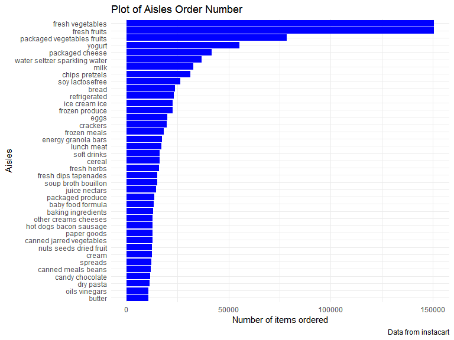
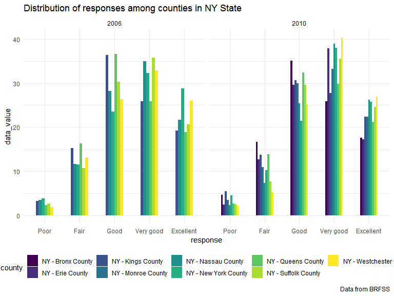

P8105 Homework 3
================
Junhui Mi
2019/10/8

# Problem 1

``` r
library(p8105.datasets)
data("instacart")
instacart %>%
  group_by(aisle) %>%
  summarize(n = n()) %>%
  arrange(desc(n)) %>%
  head(1) %>%
  knitr::kable()
```

| aisle            |      n |
| :--------------- | -----: |
| fresh vegetables | 150609 |

``` r
instacart %>%
  distinct(aisle) %>%
  nrow()
```

    ## [1] 134

``` r
instacart %>%
  group_by(aisle) %>%
  summarize(n = n()) %>%
  filter(n > 10000) %>%
  ggplot(aes(x = reorder(aisle, n), y = n)) + 
  geom_col(fill = "blue") + 
  labs(
    title = "Plot of Aisles Order Number",
    x = "Aisles",
    y = "Number of items ordered",
    caption = "Data from instacart") +
  coord_flip()
```



``` r
instacart %>%
  filter(aisle %in% c("baking ingredients", "dog food care", 
                      "packaged vegetables fruits")) %>%
  group_by(aisle, product_name) %>%
  summarize(number_of_selling = n()) %>%
  arrange(desc(number_of_selling)) %>%
  top_n(3) %>%
  knitr::kable(caption = "Three most popular products",
               col.names = c("Product category", "Product name",
                             "Number of selling"))
```

    ## Selecting by number_of_selling

| Product category           | Product name                                  | Number of selling |
| :------------------------- | :-------------------------------------------- | ----------------: |
| packaged vegetables fruits | Organic Baby Spinach                          |              9784 |
| packaged vegetables fruits | Organic Raspberries                           |              5546 |
| packaged vegetables fruits | Organic Blueberries                           |              4966 |
| baking ingredients         | Light Brown Sugar                             |               499 |
| baking ingredients         | Pure Baking Soda                              |               387 |
| baking ingredients         | Cane Sugar                                    |               336 |
| dog food care              | Snack Sticks Chicken & Rice Recipe Dog Treats |                30 |
| dog food care              | Organix Chicken & Brown Rice Recipe           |                28 |
| dog food care              | Small Dog Biscuits                            |                26 |

Three most popular products

``` r
instacart %>%
  filter(product_name %in% c("Pink Lady Apples", "Coffee Ice Cream")) %>%
  group_by(product_name, order_dow) %>%
  summarize(meantime_of_selling = mean(order_hour_of_day)) %>%
  pivot_wider(
    names_from = order_dow,
    values_from = meantime_of_selling
  ) %>%
  knitr::kable(caption = "Mean Order time of two product", 
               col.names = c("Product Name", "Sunday", "Monday", "Tuesday",
                             "Wednesday", "Thursday", "Friday", "Saturday"),
               digits = 0)
```

| Product Name     | Sunday | Monday | Tuesday | Wednesday | Thursday | Friday | Saturday |
| :--------------- | -----: | -----: | ------: | --------: | -------: | -----: | -------: |
| Coffee Ice Cream |     14 |     14 |      15 |        15 |       15 |     12 |       14 |
| Pink Lady Apples |     13 |     11 |      12 |        14 |       12 |     13 |       12 |

Mean Order time of two product

# Problem 2

    ## # A tibble: 6 x 2
    ##   locationabbr observed_locations_2002
    ##   <chr>                          <int>
    ## 1 CT                                 7
    ## 2 FL                                 7
    ## 3 MA                                 8
    ## 4 NC                                 7
    ## 5 NJ                                 8
    ## 6 PA                                10

    ## # A tibble: 14 x 2
    ##    locationabbr observed_locations_2010
    ##    <chr>                          <int>
    ##  1 CA                                12
    ##  2 CO                                 7
    ##  3 FL                                41
    ##  4 MA                                 9
    ##  5 MD                                12
    ##  6 NC                                12
    ##  7 NE                                10
    ##  8 NJ                                19
    ##  9 NY                                 9
    ## 10 OH                                 8
    ## 11 PA                                 7
    ## 12 SC                                 7
    ## 13 TX                                16
    ## 14 WA                                10


